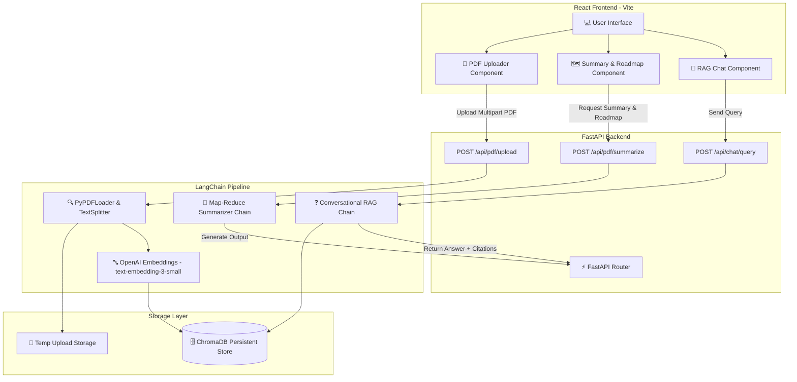

# 🏛️ System Architecture: PDF RAG & Roadmap Summarizer

## Overview
This application is designed as a decoupled, multi-tier architecture:
1. **Frontend**: React (built with Vite) - Modern, fast SPA providing file upload, interactive summary/roadmap views, and a real-time conversational RAG chat UI.
2. **Backend**: FastAPI (Python) - High-performance asynchronous REST API handling PDF parsing, chunking, embedding, summarization, and vector search.
3. **AI Framework**: LangChain v0.3+ - Document processing pipelines, Map-Reduce summarization chains, and RAG retrieval chains with page-level citations.
4. **Vector Database**: ChromaDB - Local persistent vector store for similarity search.

## Technical Decisions
- **PDF Extraction**: `PyPDFLoader` provides structured page-by-page loading with explicit page metadata (`page` index and `source_file`), enabling accurate citation rendering.
- **Chunking Strategy**: `RecursiveCharacterTextSplitter` with `chunk_size=1000` and `chunk_overlap=200` guarantees token continuity across section boundaries.
- **Summarization Strategy**: Map-Reduce pattern used to break large PDFs into parallel chunks, summarize each chunk, and combine them into a final Executive Summary + Actionable Roadmap.
- **Retrieval Strategy**: Similarity search with $k=4$ top chunks retrieved, passed into a grounded `create_stuff_documents_chain` with source citations.
