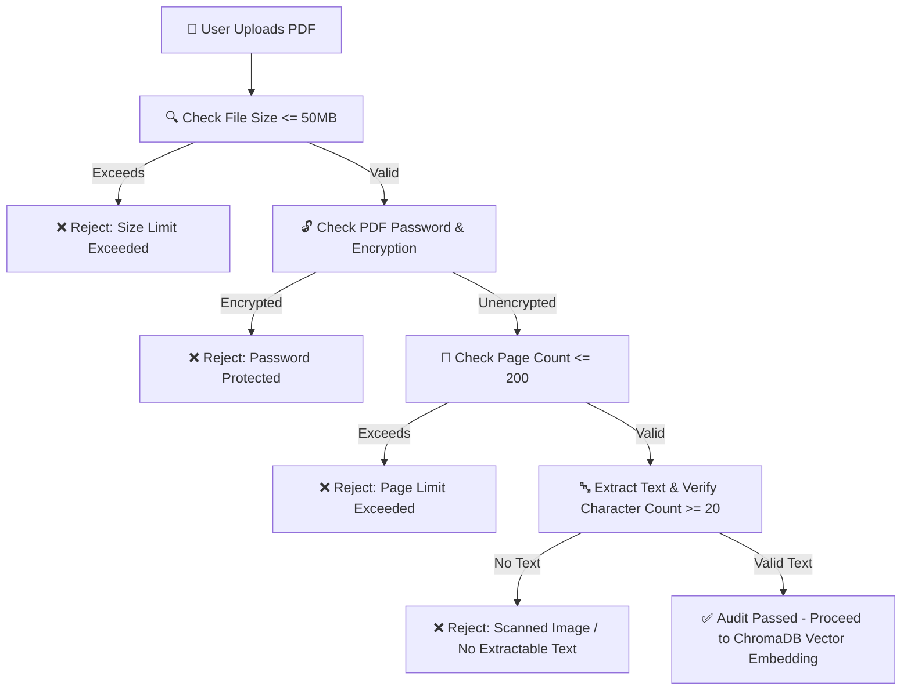

# 📋 PDF Audit & Validation Rules

## Overview
Before any PDF document is chunked or indexed into ChromaDB, it must pass a mandatory pre-embedding audit. If a document fails any audit rule, it will **not** be stored in vector memory or summarized, and an alert specifying the exact rejection reason is presented to the user.

---

## 🔍 Mandatory Audit Rules

| Rule ID | Audit Check | Threshold / Condition | Rejection Reason Message |
| :--- | :--- | :--- | :--- |
| **AUDIT-01** | **File Size Limit** | File size > 50 MB | *"File size exceeds maximum allowed limit of 50 MB."* |
| **AUDIT-02** | **Empty File Check** | File size == 0 bytes | *"Uploaded file is empty (0 bytes)."* |
| **AUDIT-03** | **Encryption / Password** | `reader.is_encrypted == True` | *"PDF is password-protected or encrypted. Please remove password protection before uploading."* |
| **AUDIT-04** | **Page Count Limit** | Page count > 200 pages | *"Document contains X pages, which exceeds the maximum limit of 200 pages."* |
| **AUDIT-05** | **Extractable Text Check** | Total extracted characters < 20 | *"PDF contains no extractable text. It may be an image-only scanned document without OCR."* |

---

## 🔄 Flow Diagram

