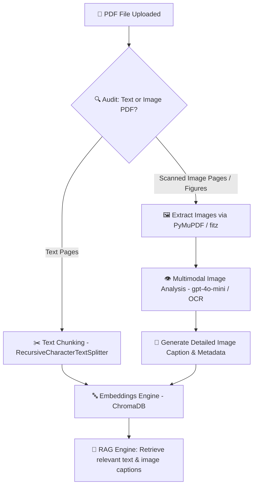

# 🖼️ Multimodal PDF RAG: Image & OCR Embedding Specification

## Overview
This document specifies how to extend the RAG pipeline to extract, caption, vector-embed, and retrieve **images, charts, figures, and scanned PDF pages**.

---

## 🏗️ Multimodal Processing Architecture



---

## 🛠️ Implementation Options

### Strategy 1: Image Captioning & Vector Indexing (Recommended & Cost Effective)
1. Extract images/figures from PDF using `fitz` (PyMuPDF) or `pypdf`.
2. Pass images to a Vision model (`gpt-4o-mini` / `gemini-1.5-flash`) to auto-generate structured descriptions (e.g., *"Chart showing revenue growth from 2023 to 2026"*).
3. Store the image caption in ChromaDB with metadata `{"type": "image", "page": X, "image_path": "..."}`.
4. When queried, RAG retrieves both text passages and image descriptions, rendering the original image in the chat interface!

### Strategy 2: OCR for Scanned Image PDFs (`pytesseract` / `EasyOCR`)
1. For scanned image PDFs without extractable text, run Optical Character Recognition (OCR).
2. Extract text from image pixels and pass to standard text chunking and vector indexing.

---

## 📋 Code Blueprint: Image & Vision Extraction Service

```python
import fitz  # PyMuPDF
import io
from PIL import Image

def extract_images_from_pdf(pdf_path: str):
    """Extracts all embedded images from a PDF file."""
    doc = fitz.open(pdf_path)
    images = []
    
    for page_index in range(len(doc)):
        page = doc[page_index]
        image_list = page.get_images(full=True)
        
        for img_index, img in enumerate(image_list):
            xref = img[0]
            base_image = doc.extract_image(xref)
            image_bytes = base_image["image"]
            image_ext = base_image["ext"]
            
            image = Image.open(io.BytesIO(image_bytes))
            images.append({
                "page": page_index + 1,
                "image": image,
                "format": image_ext
            })
            
    return images
```
