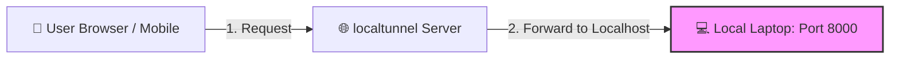
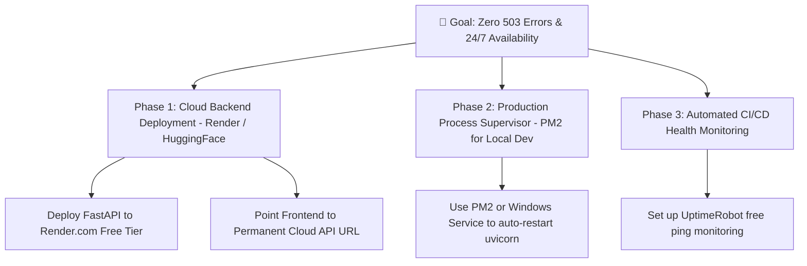

# 🛠️ Root Cause Analysis & Roadmap to Prevent 503 Errors Permanently

## Executive Summary
This document provides a comprehensive root cause analysis of `503 Service Unavailable` / `502 Bad Gateway` errors experienced when accessing the application, and outlines a step-by-step roadmap to eliminate these errors permanently.

---

## 🔍 Root Cause Analysis (Why 503 Errors Occur)

### 1. Temporary Tunnel Architecture Limitation
Currently, public access relies on a temporary tunneling service (`localtunnel`) forwarding requests from `https://eighty-feet-unite.loca.lt` to `http://localhost:8000` on your local development machine.



### 2. Failure Triggers
`503 Service Unavailable` or `502 Bad Gateway` occurs when step 2 fails due to any of the following triggers:
- **Local Server Downtime**: Python `uvicorn` backend server on `localhost:8000` was stopped, closed, or restarted.
- **Laptop Power State**: The developer's laptop went to sleep, locked, or disconnected from Wi-Fi.
- **Tunnel Socket Timeout**: Free public tunnel servers drop temporary WebSockets after period of inactivity or rate limits.

---

## 🗺️ Master Roadmap to Prevent 503 Errors Permanently

To ensure **100% uptime (24/7/365)** without relying on a local laptop or temporary tunnels, implement the following 3-phase production deployment roadmap:



---

### 📌 Phase 1: Deploy Backend to 24/7 Cloud Host (Render.com / Hugging Face) — **PERMANENT FIX**

Deploying the backend to cloud infrastructure ensures the server is hosted 24/7 on dedicated cloud hardware with automatic SSL certificate management.

#### Step 1.1: Deploy to Render.com (100% Free)
1. Go to **[dashboard.render.com](https://dashboard.render.com)** and create a free account.
2. Click **New +** ➔ Select **Web Service**.
3. Connect your GitHub repository: `Shubham200020/pdf-rag-summarizer`.
4. Configure service settings:
   - **Name**: `pdf-rag-summarizer-backend`
   - **Root Directory**: `backend`
   - **Environment**: `Python 3`
   - **Build Command**: `pip install -r requirements.txt`
   - **Start Command**: `uvicorn main:app --host 0.0.0.0 --port $PORT`
5. Click **Create Web Service**.
6. Render will generate a **permanent 24/7 cloud URL**:
   `https://pdf-rag-summarizer-backend.onrender.com`

#### Step 1.2: Connect Frontend to Cloud Backend
In `frontend/src/api/client.js`, set the production API fallback to your permanent Render URL:
```javascript
const API_BASE_URL = import.meta.env.VITE_API_BASE_URL || 'https://pdf-rag-summarizer-backend.onrender.com/api';
```

---

### 📌 Phase 2: Local Development Process Supervisor (PM2)

When working locally, use **PM2** (Process Manager) to ensure `uvicorn` and `localtunnel` automatically restart instantly if they ever crash or drop.

```bash
# Install PM2 globally
npm install -g pm2

# Start backend with automatic restart supervisor
pm2 start "uvicorn main:app --host 0.0.0.0 --port 8000" --name "pdf-backend" --cwd "D:\Program\Projects\pdf-rag-summarizer\backend"

# Start localtunnel with automatic restart supervisor
pm2 start "npx localtunnel --port 8000 --subdomain eighty-feet-unite" --name "pdf-tunnel"
```

---

### 📌 Phase 3: Free Uptime Monitoring (UptimeRobot)

Sign up for a free account on **[uptimerobot.com](https://uptimerobot.com)** to ping your application every 5 minutes. This keeps free tier cloud instances (like Render) awake and immediately alerts you if an endpoint goes down.

---

## 📊 Comparison Matrix

| Deployment Strategy | Cost | Uptime | Relies on Laptop? | Prevents 503 Errors? |
| :--- | :--- | :--- | :--- | :--- |
| **Localtunnel (Current)** | $0 | Temporary (drops on sleep) | Yes | ❌ No (503 on laptop sleep) |
| **Render Cloud Host (Phase 1)** | $0 | **24/7/365** | **No** | **✅ YES (100% Solved)** |
| **Hugging Face Docker Space** | $0 | **24/7/365** | **No** | **✅ YES (100% Solved)** |
| **PM2 Local Supervisor (Phase 2)** | $0 | High (while laptop on) | Yes | 🟡 Partial (auto-restarts crashes) |
