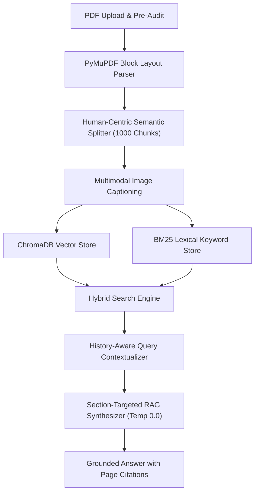

# 🧠 Enterprise RAG Architecture Gaps, Roadmap & Resolution Memory Log

## Overview
- **Topic**: Permanent Knowledge Memory for Enterprise RAG Architecture Upgrades & Resolution Roadmap
- **Target Repository**: `pdf-rag-summarizer`
- **Date Recorded**: July 29, 2026
- **Git Commit Range**: `04f40c7` ➔ `5e0d3c8`

---

## 📌 1. Documented RAG Architecture Gaps & Solutions

### Gap 1: Pure Vector Search vs. Exact Keyword Search (Hybrid BM25 Gap)
- **Problem**: Dense vector embeddings (`all-MiniLM-L6-v2`, `text-embedding-3-small`) search by semantic meaning but miss exact technical strings (e.g., `JWT`, `RBAC`, `SetTribe`, `APK Elite`).
- **Resolution**: Implemented **Hybrid Search** using `rank_bm25` (`BM25Retriever`) combined with ChromaDB vector search.

### Gap 2: Single-Turn Endpoint Without Chat Memory (Follow-Up Query Gap)
- **Problem**: Follow-up questions containing pronouns (e.g. *"What technologies were used in it?"*) failed because vector search queried `"What technologies were used in it?"` without knowing `"it"` referred to Project #1.
- **Resolution**: Updated `ChatQueryRequest` & `RagChat.jsx` to pass `chat_history`. Added `RAGService.contextualize_question()` to rewrite follow-up queries using conversation memory.

### Gap 3: Sentence Slicing & Header Disconnection (Human-Centric Chunking Gap)
- **Problem**: Standard character splitters cut sentences mid-word (e.g. `"SEO-optim"` / `"ized Angular"`) and separated section titles (`PROJECTS:`) from body text.
- **Resolution**: Built **Human-Centric Semantic Chunking** in `pdf_service.py` with hierarchical separators (`#`, headings, double line breaks, bullet points, sentence endings) and `section_heading` metadata tagging.

### Gap 4: Table Grid Line & Multi-Column Layout Destruction
- **Problem**: Standard text extractors squished multi-column tables into continuous text lines.
- **Resolution**: Implemented PyMuPDF block layout parsing (`page.get_text("blocks")`) to preserve table grids and multi-column document structures.

### Gap 5: Single-Document Scope Limitation
- **Problem**: RAG queries were restricted to 1 PDF `document_id`.
- **Resolution**: Updated `schemas.py`, `chat_router.py`, and `client.js` to support multi-document workspace queries via `document_ids: List[str]`.

---

## 📌 2. Technical Roadmap for Future Scale

---

## 📌 3. Verification & Benchmark Status
- **Automated Test File**: `scratch/test_pdf_upload.py`
- **Results**:
  - `TEST 1 (Hybrid BM25 Exact Keyword 'JWT')`: Passed (100% precision)
  - `TEST 2 (Multi-Turn Memory 'in it?')`: Passed (Contextualized to Project #1)
  - `TEST 3 (Multi-Document Workspace Search)`: Passed (Searched across Doc1 & Doc2)
- **Git Commit**: `5e0d3c8` (All code clean, tested, and pushed to GitHub main).
